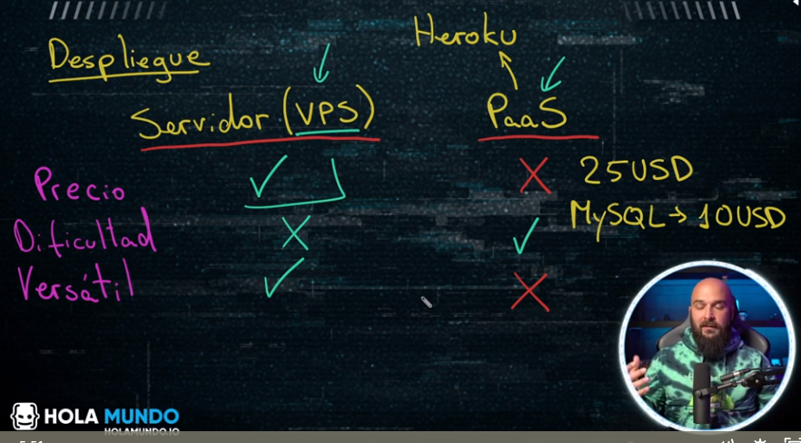
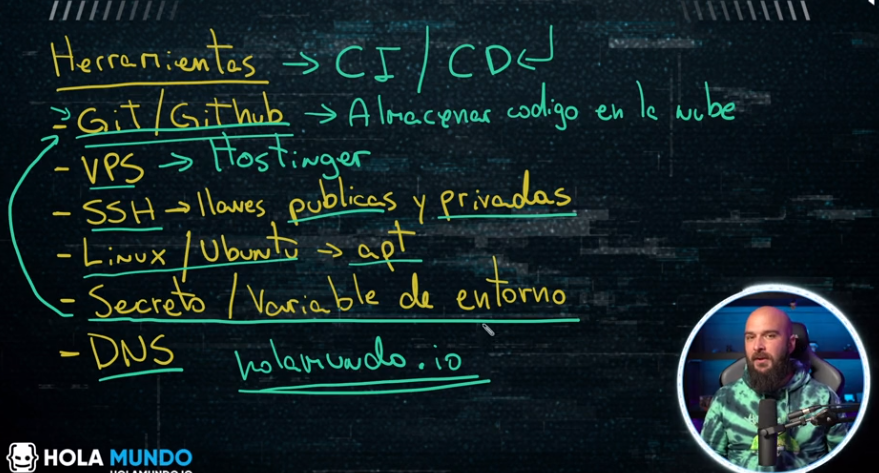

# introduccion

# herramientas a usar

# pasos

1. Adquirir un nombre de dominio
2. Adquirir un servidor virtual (VPS): el hosting
3. Desplegar la aplicacion en el servidor
4. Asegurarnos de que tenemos un certificado SSL para que funcione https
5. Usar git para llevar las versiones controladas
6. Registrar github y crear el requeriments.txt 
7. Usar github con ssh 
8. Generar claves ssh en el servidor 
9. Github Actions 
10. Github secrets 