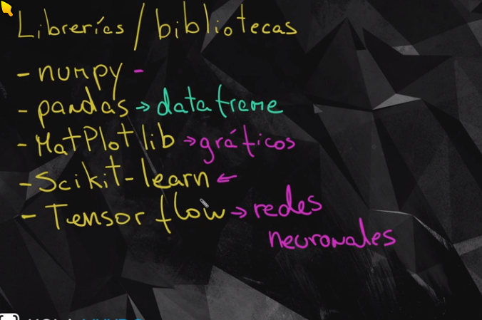

# primeros pasos


## herramientas populares



- Jupyter.org
- Anaconda.com

Instalamos anaconda para linux
```bash
sudo chmod +x Anaconda3-2023.07-2-Linux-x86_64.sh
```
se instala en /home/*usuario*/anaconda3 o en mi caso /media/WD/OPT para no ocupar espacio en disco

probamos jupyter con 
```bash
jupyter notebook
```

damos a **new** y nuevo jpykernel
escribimos y ejecutamos hola mundo y vemos que nos guarda un archivo untitled.jpynb

# ejemplo de como desinstalar anaconda
```bash
conda install anaconda-clean
anaconda-clean --yes
rm -rf ~/anaconda3
xed .bashrc #=>eliminar la parte de conda
```

# carga de datos

descargaremos datos de kaggle.com buscamos "video game" y nos descargamos "video game sales with ratings" de rush kirubi. renombramos el archivo como vg.csv
Abrimos el archivo de jupyter y añadimos
```python
import pandas as p
df = p.read_csv("vg.csv")
df.values #podremos acceder a todos los valores que se encuentran dentro de este dataframe
```
nos devuelve un array
```python
array([['Wii Sports', 'Wii', 2006.0, ..., 322.0, 'Nintendo', 'E'],
       ['Super Mario Bros.', 'NES', 1985.0, ..., nan, nan, nan],
       ['Mario Kart Wii', 'Wii', 2008.0, ..., 709.0, 'Nintendo', 'E'],
       ...,
       ['Haitaka no Psychedelica', 'PSV', 2016.0, ..., nan, nan, nan],
       ['Spirits & Spells', 'GBA', 2003.0, ..., nan, nan, nan],
       ['Winning Post 8 2016', 'PSV', 2016.0, ..., nan, nan, nan]],
      dtype=object)
```

Otro metodo (shape) nos indica el numero de filas y columnas
```python
df.shape
```
el metodo describe() devuelve una matriz con algunas filas y algunas columnas.
- **count** nos dice cuantas filas tienen ese dato relleno y si lo restamos de las filas totales sabemos cuantas filas no tienen dato
- **mean** la media o los datos que mas se repiten
- **std** desviacion estandar: de la media, cuanto se está desviando
```python
df.describe()
```
# atajos utiles

si pulsamos h saldra los atajos de teclado de jupyter
presionando la tecla de esc pasamos al modo comando (no estamos editando ninguna celda)

- Flechas arriba y abajo para desplazarse o letra **j** y **k**
- **a** para agregar una celda antes de la celda actual
- **d (dos veces)** para eliminar la celda actual
- **para recortar**, vamos al modo de insercion (cuando estamos editando una celda). Editamos, damos escape y tecla x
- **v** para pegar una celda cortada, debajo de donde estoy
- **shift+tab** ver la documentacion de un metodo
- **shift+enter** ejecuta la linea actual
- seleccionamos con ctrl y luego ctrl+enter para ejecutar las seleccionadas.


# Explicacion del problema


Por tanto queremos generar una prediccion dependiendo de los datos dados en el archivo **juegos-ml.csv**

Veremos el codigo en [notebook juegos-ml](juegos-ml.ipynb)

```python
import pandas as p
data_juegos = p.read_csv("juegos-ml.csv")
data_juegos
```

# preparando los datos

Entendemos preparar los datos a las acciones de quitar datos:
- nulos
- duplicados
- incorrectos
- no relevantes

luego dividimos en dos
- datos de entrada
- datos de salida

```python
import pandas as p
data_juegos = p.read_csv("juegos-ml.csv")
X = data_juegos.drop(columns=["juegos"])
y = data_juegos["juegos"]
```
donde X contendra las columnas de edad y genero.
donde y contendra la columna de juegos

# aprendiendo y decididiendo

Yendo a la web https://scikit-learn.org/stable/user_guide.html podremos ver los diferentes modelos que hay (como el linear model). En nuestro caso vamos a usar el "Decision Trees"


Vemos que en data_juegos no tenemos para una edad=14. Va a ser el que vamos a tratar de predecir.

```python
from sklearn.tree import DecisionTreeClassifier

modelo = DecisionTreeClassifier()
modelo.fit(X.values, y) # los dataframe sin los nombres de las columnas (por eso ponemos .values)
predicciones = modelo.predict([
    [14, 0],
    [29, 0],
    [30, 0]
]) 
#14,0 seria una tupla de X para la cual queremos hacer la prediccion edad=14, genero=0
"""
    vemos que devuelve un array de tipos "fps" para 14 años, "jrpg" para 29 años y 
    "accion" para 30 años
"""
predicciones 
```

# Midiendo exactitud de las predicciones

Para medirlo adecuadamente deberiamos de dividir nuestros datos entre datos de entrenamiento y datos de practica.

test_size va a indicar que porcentaje de datos vamos a usar para prueba. Normalmente suele ser un 80% datos de entrenamiento y un 20% datos de prueba

```python
from sklearn.tree import DecisionTreeClassifier
from sklearn.model_selection import train_test_split
from sklearn.metrics import accuracy_score
import pandas as p

data_juegos = p.read_csv("juegos-ml.csv")
X = data_juegos.drop(columns=["juegos"])
y = data_juegos["juegos"]
X_entrenar, X_prueba, y_entrenar, y_prueba = train_test_split(X.values, y, test_size=0.2)


modelo = DecisionTreeClassifier()
modelo.fit(X_entrenar, y_entrenar) 
predicciones = modelo.predict(X_prueba) 

#ahora comparamos nuestras predicciones con los datos de prueba
puntaje = accuracy_score(y_prueba, predicciones) # 0 => todas las predicciones mal, 1 => predicciones correctas
puntaje
```
Nos salen puntajes bastante aleatorios con cada ejecucion y es debido a la poca data de la que disponemos. Para que se vuelva mas estable, necesita mas datos 


# Persistencia del modelo

Vamos a ver como guardar un modelo ya entrenado y poder volver a usarlo.
Creamos una nueva celda y dejamos el codigo de esta manera
```python
from sklearn.tree import DecisionTreeClassifier
import pandas as p
data_juegos = p.read_csv("juegos-ml.csv")
X = data_juegos.drop(columns=["juegos"])
y = data_juegos["juegos"]

modelo = DecisionTreeClassifier()
modelo.fit(X.values, y) 

predicciones = modelo.predict([
    [14, 0]
]) 
predicciones 

```
con joblib guardamos el modelo
```python
from sklearn.tree import DecisionTreeClassifier
import pandas as p
import joblib

data_juegos = p.read_csv("juegos-ml.csv")
X = data_juegos.drop(columns=["juegos"])
y = data_juegos["juegos"]

modelo = DecisionTreeClassifier()
modelo.fit(X.values, y) 
predicciones = modelo.predict([
    [14, 0]
]) 

joblib.dump(modelo, "recomendador-juegos.joblib") 
```
Y para cargar el modelo y usarlo:
```python
import joblib

modelo = joblib.load("recomendador-juegos.joblib") 
predicciones = modelo.predict([[14, 0]]) 
predicciones
```
